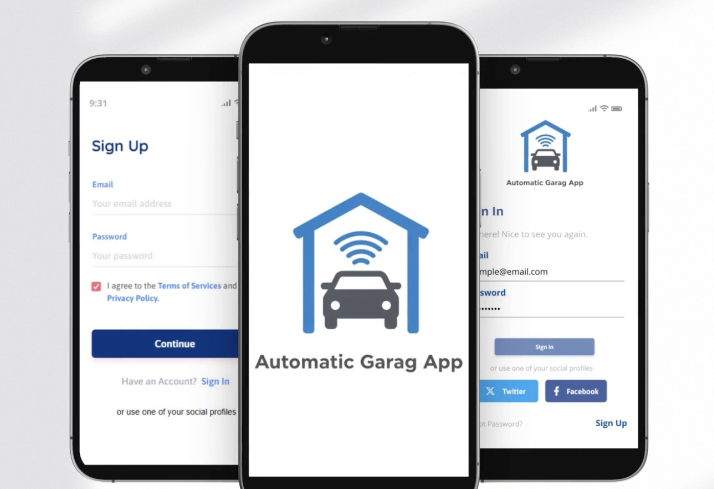
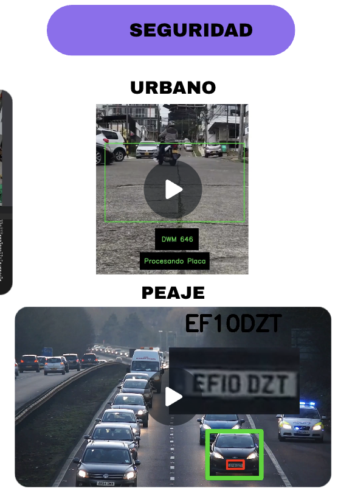
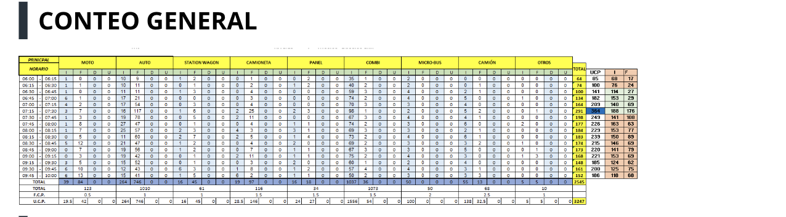
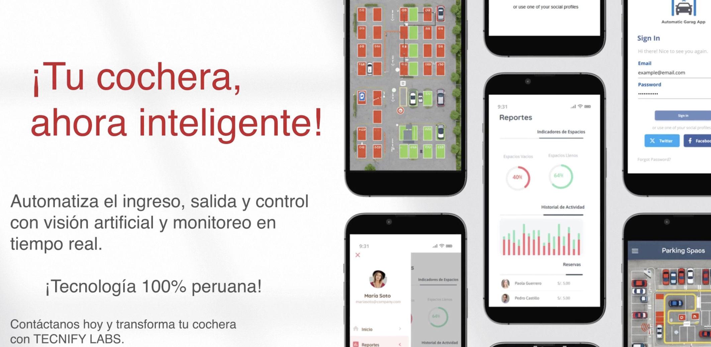

# 🚗 Sistema de Playa de Estacionamiento Automatizada



## 📋 Descripción

Este proyecto implementa un sistema completo de gestión de playa de estacionamiento que utiliza visión por computadora e inteligencia artificial para automatizar el proceso de registro y control de vehículos. El sistema es capaz de detectar automáticamente placas de vehículos y licencias de conducir, gestionar el acceso al estacionamiento y proporcionar análisis en tiempo real.

## 🎯 Características Principales

### 1. Detección Automática de Vehículos
- Reconocimiento en tiempo real de vehículos que ingresan y salen
- Clasificación de tipos de vehículos (automóviles, motocicletas, camiones, etc.)
- Registro automático de horarios de entrada y salida

### 2. Sistema OCR Avanzado
- Lectura automática de placas vehiculares
- Reconocimiento de licencias de conducir
- Validación de información contra bases de datos

### 3. Panel de Control en Tiem Real
- Monitoreo de ocupación del estacionamiento
- Estadísticas de uso y ocupación
- Gestión de pagos y facturación

### 4. Seguridad y Control de Acceso
- Registro detallado de todos los movimientos
- Alertas de seguridad
- Control de acceso mediante reconocimiento de placas

## 🖼️ Capturas de Pantalla

### 1. Interfaz Principal

*Vista general del sistema mostrando el estado actual del estacionamiento*

### 2. Detección de Placas

*Proceso de reconocimiento de placas vehiculares en tiempo real*

### 3. Panel de Control

*Dashboard con estadísticas y métricas en tiempo real*

## 🛠️ Requisitos Técnicos

- Python 3.8 o superior
- OpenCV 4.5 o superior
- YOLOv8 para detección de objetos
- EasyOCR para reconocimiento de texto
- Streamlit para la interfaz web
- Navegador web moderno

## 🚀 Instalación

1. **Clonar el repositorio**
   ```bash
   git clone [URL_DEL_REPOSITORIO]
   cd playa_estacionamiento
   ```

2. **Crear y activar entorno virtual** (recomendado)
   ```bash
   python -m venv venv
   source venv/bin/activate  # En Windows: venv\Scripts\activate
   ```

3. **Instalar dependencias**
   ```bash
   pip install -r requirements.txt
   ```

4. **Ejecutar la aplicación**
   ```bash
   streamlit run app.py
   ```

5. **Acceder a la aplicación**
   Abre tu navegador y ve a `http://localhost:8501`

## 🧠 Tecnologías Utilizadas

- **Visión por Computadora**: OpenCV, YOLOv8
- **Reconocimiento de Texto**: EasyOCR, Tesseract OCR
- **Backend**: Python, Streamlit
- **Procesamiento de Imágenes**: PIL, NumPy
- **Base de Datos**: SQLite (para almacenamiento local)

## 📊 Funcionalidades Adicionales

- **Reportes Automáticos**: Generación de reportes diarios, semanales y mensuales
- **Notificaciones**: Alertas por correo electrónico para eventos importantes
- **API REST**: Integración con otros sistemas
- **Soporte Multiplataforma**: Funciona en Windows, macOS y Linux

## 🤝 Contribución

Las contribuciones son bienvenidas. Por favor, lee nuestras pautas de contribución para más detalles.

